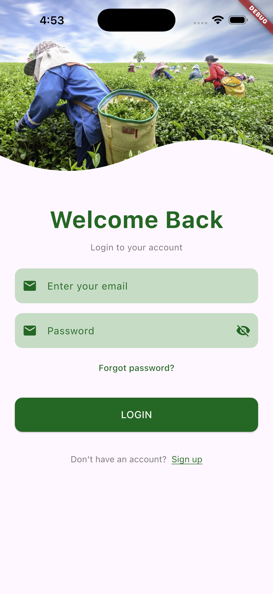
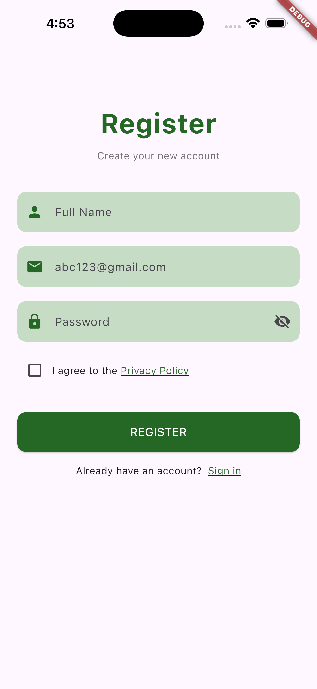
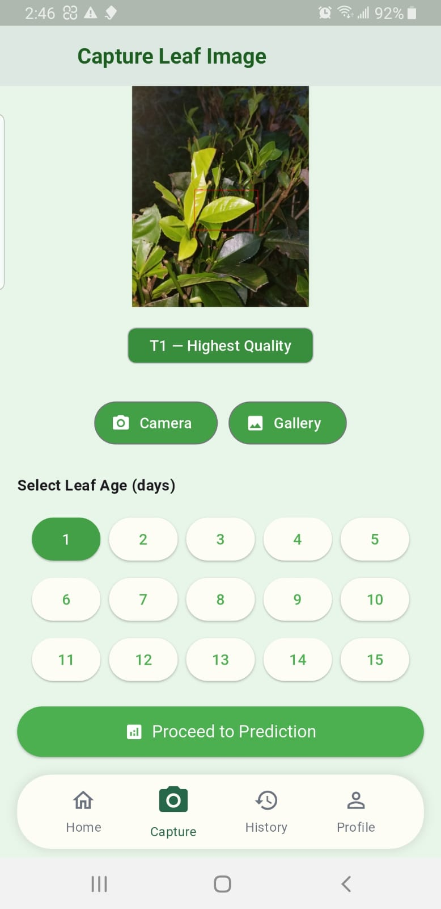
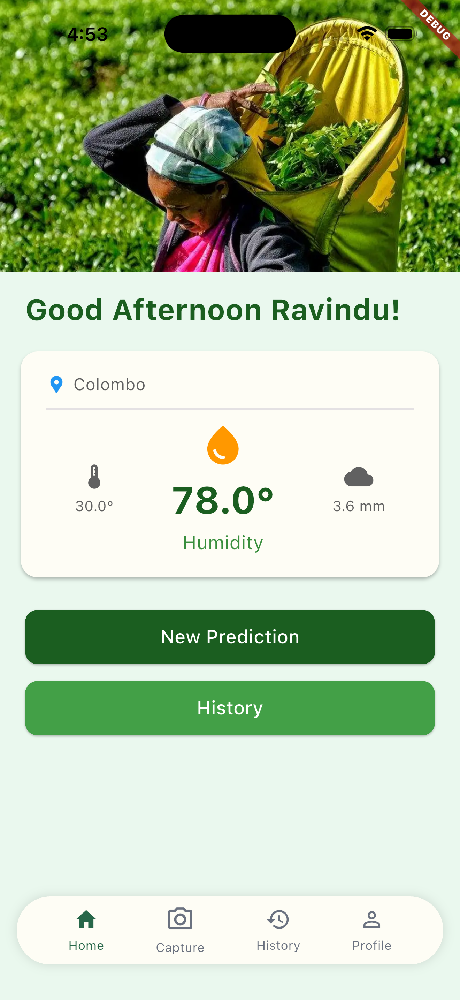
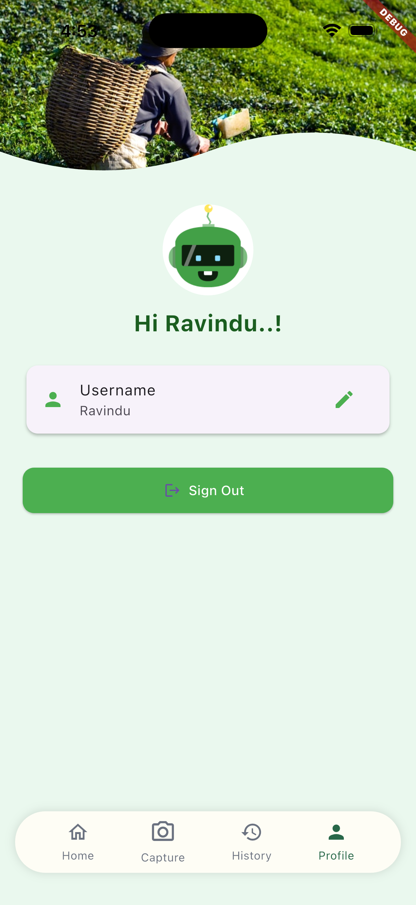

# TeaOptima 

Research system for analyzing tea leaf quality and forecasting quality degradation using hybrid AI/ML models integrated with weather and environmental data, accessible via a mobile interface.

&nbsp;
&nbsp;
&nbsp;
&nbsp;
&nbsp;
&nbsp;
&nbsp;
&nbsp;
&nbsp;
&nbsp;

## Publication

[](https://doi.org/10.1109/MERCon67903.2025.11216994)

My **research paper** behind *TeaOptima* was **presented at the Moratuwa Engineering Research Conference (MERCon) 2025** and **published in IEEE**:

**R. J. Bandara and A. Kuruppu**, “*Predictive Analytics for Tea Leaf Aging and Quality Degradation*,” *2025 Moratuwa Engineering Research Conference (MERCon)*, Moratuwa, Sri Lanka, pp. 239–244, 2025.  

📄 [Read the paper on IEEE Xplore](https://ieeexplore.ieee.org/document/11216994)


## UI Samples

<p align="center">
  
  
  <!--  -->
  
  
  <!--  -->
</p>

## Features

- 📸 **Image Classification**: 
  - Capture high-resolution images of tea leaves directly from the app.
  - Utilize advanced machine learning models to analyze and classify the quality of tea leaves based on visual characteristics.

- 🔮 **Degradate Prediction**: 
  - Leverage AI-powered algorithms to predict the degradation of tea leaves over time.
  - Provide users with insights into the expected quality changes, helping in better inventory and quality management.

- 🌤️ **Weather Integration**: 
  - Integrate real-time weather data to assess its impact on tea quality.
  - Use OpenWeatherMap API to fetch current weather conditions and forecasts, influencing tea leaf quality predictions.

- 📊 **Data Visualization**: 
  - Display comprehensive charts and graphs to visualize quality trends over time.
  - Enable users to track historical data and make informed decisions based on visual analytics.

- 🔥 **Firebase Integration**: 
  - Implement secure user authentication using Firebase Auth.
  - Store user data and app configurations in Firebase Firestore for seamless data management and retrieval.

- 📱 **Cross-Platform**: 
  - Ensure compatibility across iOS, Android, and Web platforms.
  - Provide a consistent user experience regardless of the device or platform used.

## Setup Instructions

### Prerequisites

- Flutter SDK (3.7.0+)
- Firebase project
- OpenWeatherMap API account (optional)

### 1. Clone the Repository

```bash
git clone https://github.com/RavJayB/tea-leaf-quality-prediction.git
cd tea-quality-app
```

### 2. Install Dependencies

```bash
flutter pub get
```

### 3. Environment Configuration

**⚠️ Required**: You must create a `.env` file with the required API key.

1. Copy the environment template:
   ```bash
   cp .env.example .env
   ```

2. Edit `.env` and replace placeholder values:
   ```env
   # Required - Get from https://openweathermap.org/api
   OPENWEATHER_API_KEY=your_actual_openweather_api_key
   
   # Optional - Override default service URLs if needed
   IMAGE_SERVICE_URL=your_image_service_url   # contains YOLOv8 Model 
   DEGRADE_SERVICE_URL=your_degrade_service_url  # contains Random Forest Model
   ```

**Note**: The app will crash on startup if `OPENWEATHER_API_KEY` is missing. Service URLs have fallback values for development.

### 4. Firebase Configuration

1. Copy the Firebase template:
   ```bash
   cp lib/firebase_options.example.dart lib/firebase_options.dart
   ```

2. Replace placeholder values in `lib/firebase_options.dart` with your Firebase project credentials:
   - Get these from Firebase Console > Project Settings > General tab
   - Replace all `YOUR_*` placeholders with actual values

3. Download and place platform-specific config files:
   - **Android**: `google-services.json` → `android/app/`
   - **iOS**: `GoogleService-Info.plist` → `ios/Runner/`

### 5. API Keys Setup

#### OpenWeatherMap API (Required)

1. Sign up at [OpenWeatherMap](https://openweathermap.org/api)
2. Get your free API key
3. Add it to your `.env` file - **this is required for the app to run properly**

#### Backend Services

If you have your own ML services, update the URLs in `.env`:
- `IMAGE_SERVICE_URL`: Your image classification endpoint
- `DEGRADE_SERVICE_URL`: Your quality prediction endpoint

### 6. Run the App

```bash
flutter run
```

## Project Structure

```
lib/
├── main.dart                 # App entry point
├── firebase_options.dart     # Firebase configuration (excluded from git)
├── screens/                  # UI screens
├── services/                 # Business logic and API calls
│   ├── api_service.dart      # ML service integration
│   ├── auth_service.dart     # Firebase authentication
│   └── config_service.dart   # Environment configuration
└── widgets/                  # Reusable UI components
```

## Security Considerations

This project is configured for safe public repository sharing:

- ✅ API keys are externalized to `.env` files
- ✅ Firebase configuration uses templates
- ✅ Sensitive files are in `.gitignore`
- ✅ Fallback values for development

**Never commit real API keys or credentials to version control.**

## Development

### Adding New Environment Variables

1. Add the variable to `.env.example`
2. Update `lib/services/config_service.dart`
3. Use `ConfigService.yourVariable` in your code

### Firebase Setup

If you need to reconfigure Firebase:

```bash
flutterfire configure
```

## Troubleshooting

### Common Issues

1. **"Missing OPENWEATHER_API_KEY"**: Create a `.env` file with your OpenWeatherMap API key
2. **"Classification failed (500)"**: Backend service is down or misconfigured
3. **Firebase initialization errors**: Check `firebase_options.dart` configuration
4. **Weather data not loading**: Verify OpenWeatherMap API key in `.env`
5. **Build errors**: Run `flutter clean && flutter pub get`

### Getting Help

- Check the [Flutter documentation](https://docs.flutter.dev/)
- Review Firebase setup guides
- Ensure all API keys are correctly configured
- For any questions or collaboration, Contact me through my portfolio: [ravindubandara.dev](https://ravindubandara.dev)

## Contributing

1. Fork the repository
2. Create a feature branch
3. Follow the security guidelines for API keys
4. Submit a pull request

## License

This project is licensed under the MIT License - see the LICENSE file for details.
